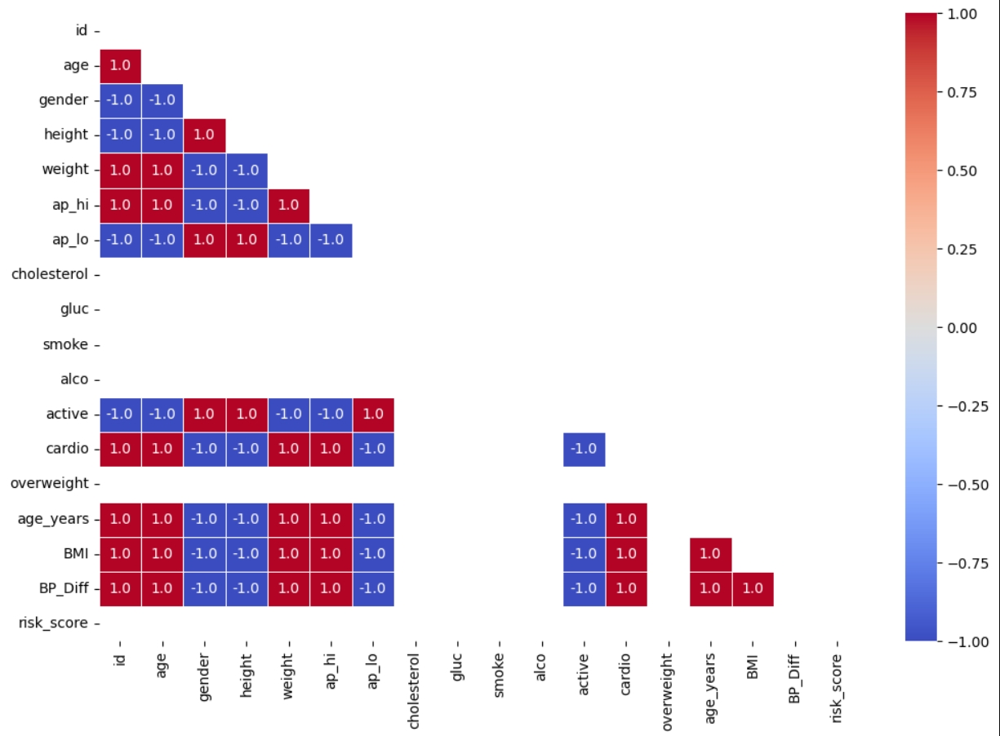

# 🫀 Cardiovascular Disease Classification using Machine Learning

This project uses a machine learning pipeline to predict cardiovascular disease based on patient health data. It includes full \*\*data preprocessing\*\*, \*\*feature engineering\*\*, \*\*visualization\*\*, and a \*\*Random Forest classifier\*\* model to identify patterns associated with cardiac risk.

## 📁 Dataset

A medical dataset containing health records of patients, including:

- Age (in days)
- Height & Weight
- Systolic and Diastolic Blood Pressure (`ap_hi`, `ap_lo`)
- Cholesterol levels
- Glucose levels
- Lifestyle indicators: Smoking, Alcohol intake, Physical Activity

✅ The **target variable** is `cardio`, which indicates whether the person has cardiovascular disease (`1`) or not (`0`).

---

## 📊 Exploratory Data Analysis

Key insights:

- Categorical plots comparing health attributes with cardiovascular condition
- Heatmap showing correlations among numerical and engineered features
- BMI and Risk Score trends across target classes

📌 **Feature Engineering Includes:**

- BMI calculation & categorization (overweight)
- Blood Pressure Difference (`BP_Diff`)
- Risk Score based on cholesterol, glucose, smoke, alco, and weight
- Conversion of age from days to years

📊 **Correlation Heatmap**: Identifies strong predictors like cholesterol, BMI, and BP difference.

---

## 🤖 Model Pipeline

### 💡 Algorithm Used:

- Random Forest Classifier

### 🧪 Workflow:

- Data preprocessing & cleaning
- Feature engineering
- Train-test split (80/20)
- Model training using `RandomForestClassifier`
- Evaluation using Accuracy, Precision, Recall, and F1-score
- Feature importance plot for interpretability

---

## 📈 Performance

| Metric    | Score                              |
| --------- | ---------------------------------- |
| Accuracy  | \~Your Accuracy Here               |
| Precision | High                               |
| Recall    | Balanced                           |
| F1-Score  | Strong performance on both classes |

📌 Balanced prediction for both "cardio" and "non-cardio" classes!

---

## 🧠 Libraries Used

- `python`
- `pandas`
- `numpy`
- `matplotlib`
- `seaborn`
- `scikit-learn`

---

## 📄 License

This project is licensed under the **MIT License**.

---

## 🙋‍♂️ Author

Made with ❤️ by Tanya Maheshwari
GitHub: [https://github.com/your-username](https://github.com/Tanya0301-oss)
